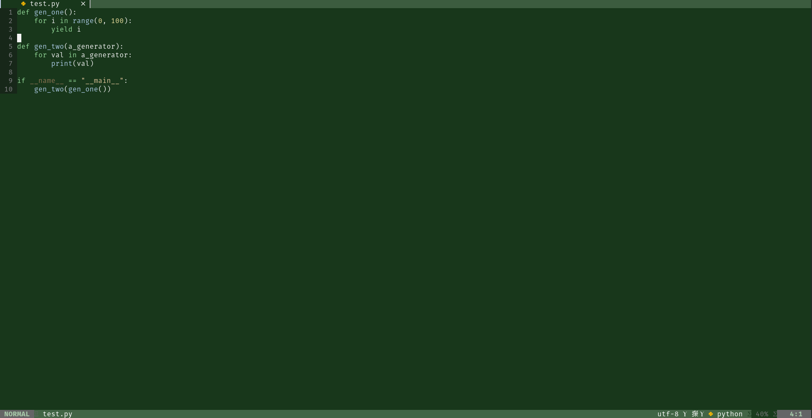

# Ponderosa theme for [Neovim](https://github.com/neovim/neovim)
- Default

- Faded

- Terra


Made with [lush](https://github.com/rktjmp/lush.nvim)

## Usage
Install with any plugin manager, [lush](https://github.com/rktjmp/lush.nvim) is required.
Example with [packer.nvim](https://github.com/wbthomason/packer.nvim):
```lua
use {
    'acass91/ponderosa.nvim',
    requires = {'rktjmp/lush.nvim'}
}
```

## Configuration
Here is an example with the default config. 
There are three dark themes available - default, faded, and terra.
No light themes are available.

```lua
require 'ponderosa'.setup({
    dark_theme = 'default'
    plugins = {
		  -- No plugin integrations at the moment
    }
})
```

## Contributing
Any PRs or issues regarding highlighting fixes/improvements or new plugins are very welcome.

## Author
- [Adam Cass](https://github.com/acass91)

## License
[MIT](./LICENSE)
